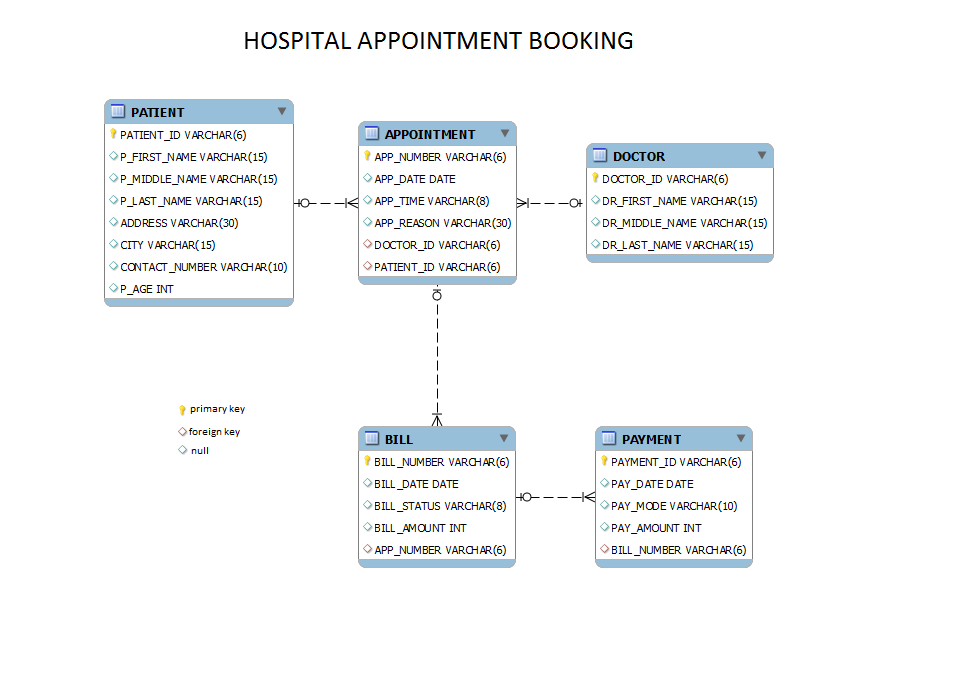

# Patient Appointment Details based on reason

Refer to the given schema.

Write a query to display the patient id, patient first name, patient age, appointment number and the date of appointment of those patients whose reason for the appointment is 'FEVER'. Sort the records based on patient id.

> Hint: 

Use the Appointment table and Patient table to retrieve the records. Data is case-sensitive

