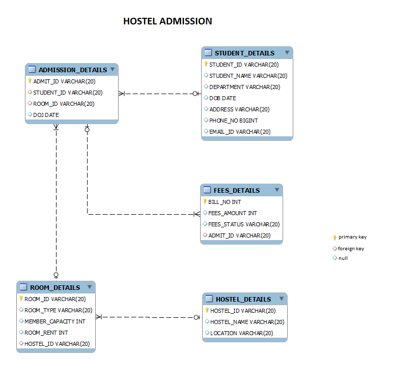

# Movie-Modify the datatype set2

Refer to the given schema. Assume that the Customer_master table has been already created.

Write a query to change the data type of the field phone_no in Customer_Master table to int(10).

