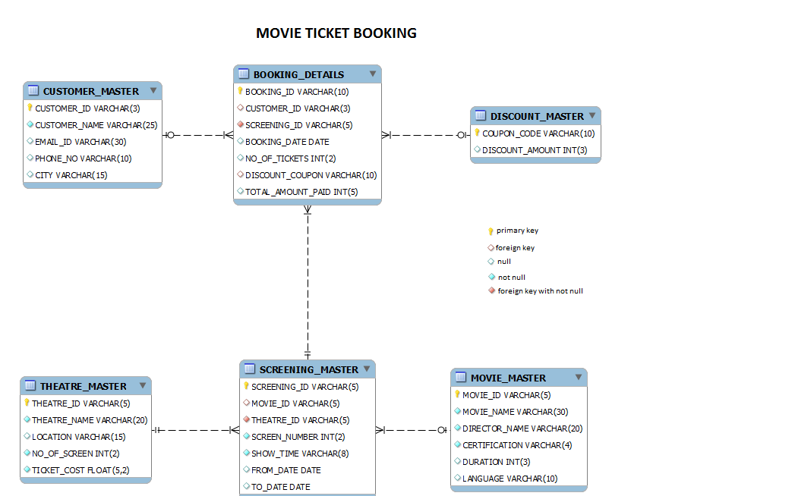

# Minimum & Maximum Discount Amount

Write a query to display the minimum discount amount and the maximum discount amount offered as per the coupon. Give an alias name as MIN_DISCOUNT to the minimum discount amount and MAX_DISCOUNT to the maximum discount amount.

> NOTE: 

Maintain the same sequence of column order, as specified in the question description

