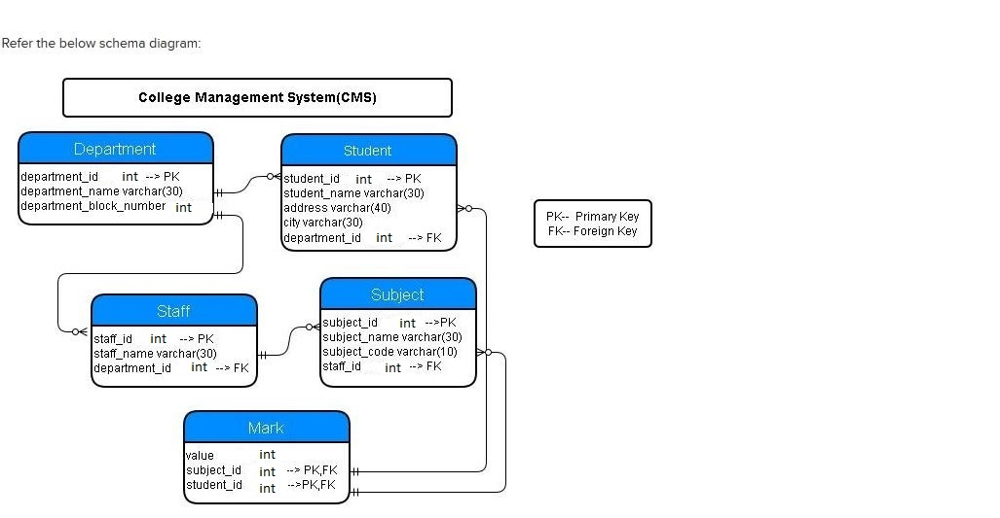

# Concatenating Details

Write a query to display address details by concatenating address and city of students . Give an alias as Address and sort the result based on the concatenated column in descending order

> Example: 

    Address - Toms Town

    City - Bangalore

> Output:

    Toms Town, Bangalore

