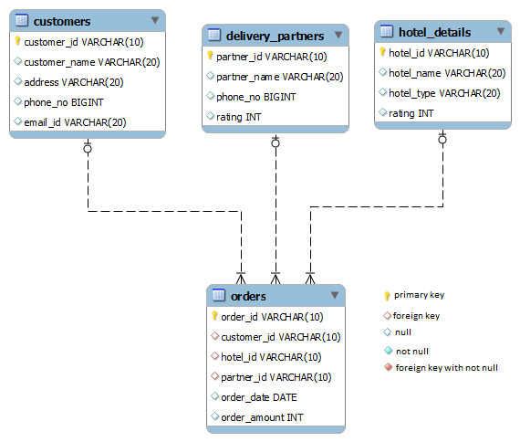

# Hotels not taken orders in a specific month

Write a query to display hotel id, hotel name and hotel type of hotels which has not taken any orders in the month of 'MAY 19'. Sort the result based on hotel id in ascending order.

> HINT: Use Hotel_details and Orders tables to retrieve records. Eg: order_date= 2019-05-12

*NOTE: Maintain the same sequence of column order, as specified in the question description*

