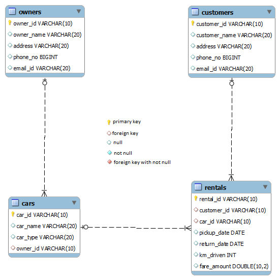

# No of time rented by each car

Write a query to display car id and number of times car taken for rental. Give an alias name to the number of times car taken for rental as 'NO_OF_TRIPS'. Sort the records based on car id in ascending order.

> (HINT: Use Rentals table to retrieve records.)

