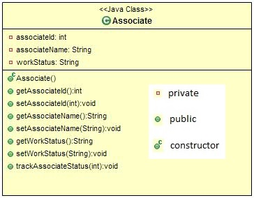

# DreamTek Company

DreamTek Company provides an initial training for all its employees, once they join the company. During the training phase they call the employees as “Associate”. The initial training is conducted for 60 days for each Associate. In these 60 days they learn various technologies. The first 20 days they learn “Core skills”, the next 20 days they learn “Advanced modules” and the final 20 days they go to the “Project phase”.  Help the DreamTek Company to find in which phase the associates are in.

Consider the below class:

In the Associate class include the given attributes and methods with the access specifiers as specified in the class diagram.

The setter methods are used to set the value and the getter methods are used to retrieve the value.

The trackAssociateStatus method takes the number of days as argument and sets the work status of the associate based on the number of days. If the number of days is greater than 60 days then set the work status as “Deployed in project”.

In the Main class, create an object for the Associate class; Get the details as shown in the sample input and assign the value for its attributes using the setters. Invoke the trackAssociateStatus method and find the work status and display the details as shown in the sample output.

> Sample Input1:

    Enter the associate id:
    123
    Enter the associate name:
    john
    Enter the number of days:
    45

> Sample Output1:

    The associate john work status:Project phase

--- 

> Sample Input2:

    Enter the associate id:
    124
    Enter the associate name:
    ram
    Enter the number of days:
    70

> Sample Output2:

    The associate ram work status: Deployed in project