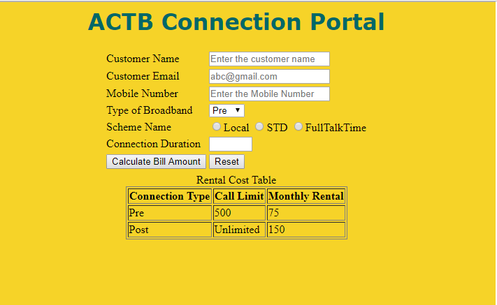
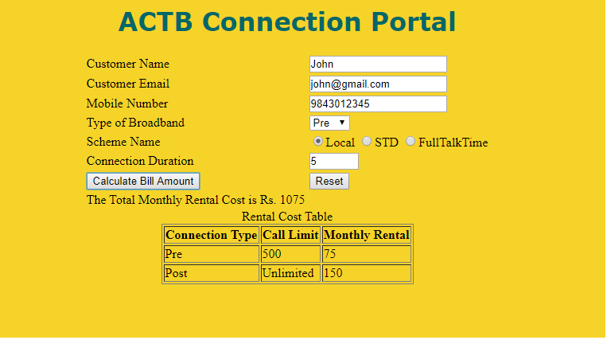

# ACTB Connection Portal

ACTB Limited offers prepaid and postpaid connections for their customers. They have planned for various schemes to be offered for the customers opting for these connections.

Create a webpage “Connection.html” that has the following fields.

*Note: Every tag has been given a mark. Make sure the element names are correct*

| SNO | LABEL NAME | COMPONENT NAME | DESCRIPTION |
| --- | ---------- | -------------- | ----------- |
| 1 | Customer Name | custname | To enter the name of the customer. The text “Enter the customer name” should be displayed by default in the text box. While entering the name, this text should disappear |
| 2 | Customer Email | email | To enter the email-id of the customer. The text “abc@gmail.com" should be displayed by default in the text box. While entering the e-mail, this text should disappear. This field should accept a valid email. |
| 3 | Telephone / Mobile Number | mobile | To enter the mobile number. The mobile number should accept only digits. The text “Enter the Mobile Number" should be displayed by default in the text box. It should contain 10 digits and start with 9/8/7. | 
| 4 | Connection Type | conntype | The scheme options are displayed in radio button and the schemes are Local, STD and FullTalkTime. Have the scheme id attributes as scheme1, scheme2 and scheme3 respectively. | 
| 5 | Scheme Name | scheme | The scheme options are displayed in radio button and the schemes are Local, STD and FullTalkTime. Have the scheme id attributes as scheme1, scheme2 and scheme3 respectively. |
| 6 | Connection Duration | duration | The connection duration can be taken for any number of months, Assume min value is 1 and max value is 12. |
| 7 | Connection Bill Amount | submit | On clicking this button, the connection  bill amount should be calculated. |
| 8 | Reset | clear | On clicking this button, all fields should be reset. | 

## Rules / Constrains : All validations should be based on HTML5 (Do Not use JavaScript)

- The component name should be same as given above.
- All fields are mandatory.
- Customer name should contain only alphabets and space.
- Mobile Number should be of 10 digits and should start with 9/8/7.
- The Connection Type needs to be Pre or Post.
- The scheme names are Local, STD and FullTalkTime.
- The Connection Duration can be specified ranging from 1 to 12 months.

> Refer the below table for the scheme costs

| Scheme | Cost Per Month |
| ------ | -------------- |
| Local | 200 |
| STD | 350 |
| FullTalkTime | 500 |

## Use JavaScript for doing the below calculation:

On clicking the Connection Bill Amount button, the monthly rental cost has to be displayed based on the Connection Type as in the Rental Cost Table  given below. The available options for connection type are Pre and Post. Refer the table below for monthly rental cost for the connection. 

> Rental Cost Table

| Connection Type | Call Limit | Monthly Rental |
| --------------- | ---------- | -------------- |
| Pre | 500 | 75 |
| Post | Unlimited | 150 |

The bill amount has to be calculated and displayed as **“The Total Monthly Rental Cost is Rs. ”+ Total Monthly Rental Cost**, in a div tag. The div tag name should be `“result”`.

Use the following formula to calculate the Total Monthly Rental Cost:

    Total Monthly Rental Cost = (duration * Cost per month) + Monthly Rental 

## Sample Webpage:

## Output Page:

## Styles to be applied: (Do not use Inline CSS)

1. Body color should be #EED426.
2. The heading ACTB Connection Portal should be done using `<h1>` tag and the text color should be#006666. Style should be verdana and it should be aligned to centre of the webpage.
3. For the “Rental Cost table” the border-style should be solid and border size should be 1. It should be displayed on the right side (use float) of the webpage. The text inside the table should be aligned to centre. The table should have the id attribute with the value as `“rentalcost”`.