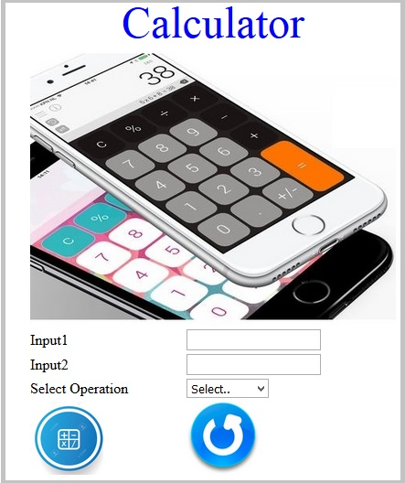

# Simple CALCULATOR

Create the following Web page with the heading 'Calculator' and provided images. 

The web page should contain following input elements and apply the specified Constraints:

| Label Name | Element Name | Constraints |
| ---------- | ------------ | ----------- |
| Input1 | input1 | This element is to get the first input. Type should be 'number' | 
| Input2 | input2 | This element is to get the second input. Type should be 'number' |
| Select Operation | operation | A drop down list contains the following values: **Select.. , ADD, SUBTRACT, MULTIPLY and DIVIDE.** *Set these values as its option tag text and option tag's 'value' attributes* | 
|  | submit | An image tag with the source as calc.jpg should be displayed | 
|  | reset | An image tag with the source as reset.jpg should be displayed | 

Consider the images are in the current folder and

- Use “calculator.jpg” as a header image.

> Apply following styles to the attributes: *Do not use CSS.*

1. The heading should be done using the font color as 'blue' and with font size as '20'. (Use `` tag)
2. The height and width of the images with the name “submit” and “reset” should be '80'.
3. The height and width of the calculator image should be '300' and '400'.